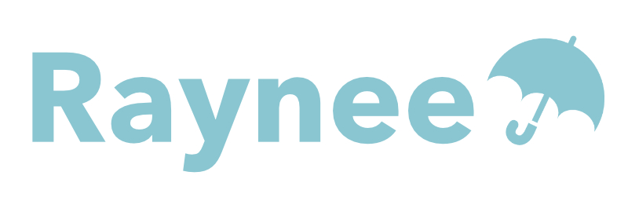

# README

# Raynee

## アプリケーションURL
https://raynee.herokuapp.com

## 概要
雨の日に人と人のつながりが生まれる傘シェアリング＆マッチングサービスです。 
傘を持っていないユーザーが自分のいる場所に近いユーザーを探してリクエストを送信し、 
相手から承諾されたのちに直接メッセージのやり取りができるようになります。

## バージョン
Ruby 2.6.3  
Rails 5.2.4

## 機能一覧
- ログイン機能
- ユーザー登録機能
- ユーザー検索機能
- プロフィール編集機能
- リクエスト承諾通知機能
- キャンセル通知機能
- マッチング機能
- メッセージ機能

## カタログ設計
https://docs.google.com/spreadsheets/d/1jkdfB5QhGuiCdXwYa5FgVRzbw0I_XxRPcuP8uJx127I/edit?usp=sharing

## テーブル定義
https://docs.google.com/spreadsheets/d/1rITo7L0AhSnEWOgwoJu_YKJhjzPJmmG3H8ITqfGD6tg/edit?usp=sharing

## 画面遷移図
https://docs.google.com/spreadsheets/d/16D7C_iYghqZb075Qxy524ciJA_B9JudhNZLSwvhayU0/edit?usp=sharing

## 画面ワイヤーフレーム
https://docs.google.com/spreadsheets/d/1RfgUJXfSwmt3_wmU9-IuWb5Uab-FeYfrTjCGFCquHQo/edit?usp=sharing

## 使用Gem
ログイン系
* devise
* devise-i18n
* devise-i18n-views

画像投稿
* CarrierWave

検索機能
* ransack

デバッグ
* pry-rails

テスト
* rspec-rails
* factory_bot_rails
