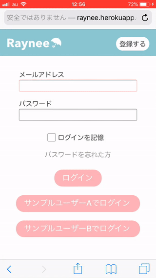
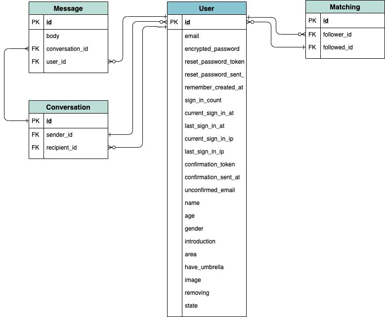

# README

# Raynee

## アプリケーションURL
<h3>https://raynee.herokuapp.com</h3>

### アプリのQRコード▼

## 概要
雨の日に人と人のつながりが生まれる傘シェアリング＆マッチングサービスです。 
傘を持っていないユーザーが自分のいる場所に近いユーザーを探してリクエストを送信し、 
相手から承諾されたのちに直接メッセージのやり取りができるようになります。 

### このサービスを作ろうと思ったきっかけ ☔︎
天気予報を確認しないまま傘を持たずに家を出てしまい、目的地に着く頃には土砂降りの雨。 
駅構内のコンビニでビニール傘を買ってしのいだものの、帰る頃には雨が止んでいた... 
 
こんな経験ありませんか？ 
 
気づいたら家の玄関に新しいビニール傘が溜まっていく一方。 
もし、傘が必要な時に自分の近くにいる知らない人が相合傘してくれたら、どんなに素敵な世の中でしょうか。 
ふとそう思ったのがこのアプリを作るきっかけでした。 
 
傘を無駄に購入する必要なくちょっとした出会いのきっかけにもなるサービス。 
 
それがRaynee☂️です。 

## バージョン
Ruby 2.6.3  
Rails 5.2.4

## 機能一覧
- ログイン機能
- ユーザー登録機能
- ユーザー検索機能
- プロフィール編集機能
- リクエスト承諾通知機能
- キャンセル通知機能
- マッチング機能
- メッセージ機能

## スクリーンショット

## 使い方
1. スマホとPC/Mac、もしくは2種類のブラウザを用意してそれぞれ以下のURLにアクセスします。  URL▼ https://raynee.herokuapp.com   QRコード▼ 
2. 一方を「サンプルユーザーA」でログインし、他方を「サンプルユーザーB」でログインします。
3. それぞれ「利用を開始」をクリックします。
4. サンプルユーザーAでログインした方のデバイスのユーザー一覧からサンプルユーザーB(サンプルBちゃん)を見つけてクリックし、「この人にリクエストを送る」をクリックします。
5. サンプルユーザーBでログインした方のデバイスのリクエスト一覧にサンプルユーザーAが表示されるのでクリックし、「承諾する」をクリックするとメッセージ画面に移動します。
6. サンプルユーザーAでログインした方のデバイスにリクエストが承諾された旨の通知が表示されるので、この通知をクリックし、「お願いする」をクリックするとメッセージ画面に移動します。
7. マッチング完了です。それぞれのユーザーからメッセージを送り合ってみてください。

## カタログ設計
[こちらで確認できます](https://docs.google.com/spreadsheets/d/1jkdfB5QhGuiCdXwYa5FgVRzbw0I_XxRPcuP8uJx127I/edit?usp=sharing)

## テーブル定義
[こちらで確認できます](https://docs.google.com/spreadsheets/d/1rITo7L0AhSnEWOgwoJu_YKJhjzPJmmG3H8ITqfGD6tg/edit?usp=sharing)

##  ER図

## 画面遷移図
https://docs.google.com/spreadsheets/d/16D7C_iYghqZb075Qxy524ciJA_B9JudhNZLSwvhayU0/edit?usp=sharing

## 画面ワイヤーフレーム
https://docs.google.com/spreadsheets/d/1RfgUJXfSwmt3_wmU9-IuWb5Uab-FeYfrTjCGFCquHQo/edit?usp=sharing

## 使用Gem
ログイン系
* devise

画像投稿
* CarrierWave
* MiniMagick
* fog-aws

検索機能
* ransack

デバッグ
* pry-rails

テスト
* rspec-rails
* factory_bot_rails
